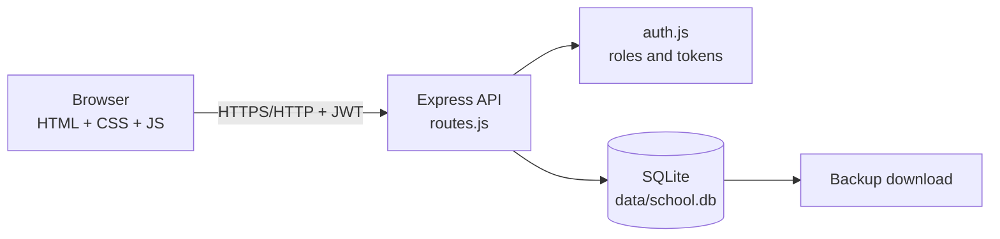
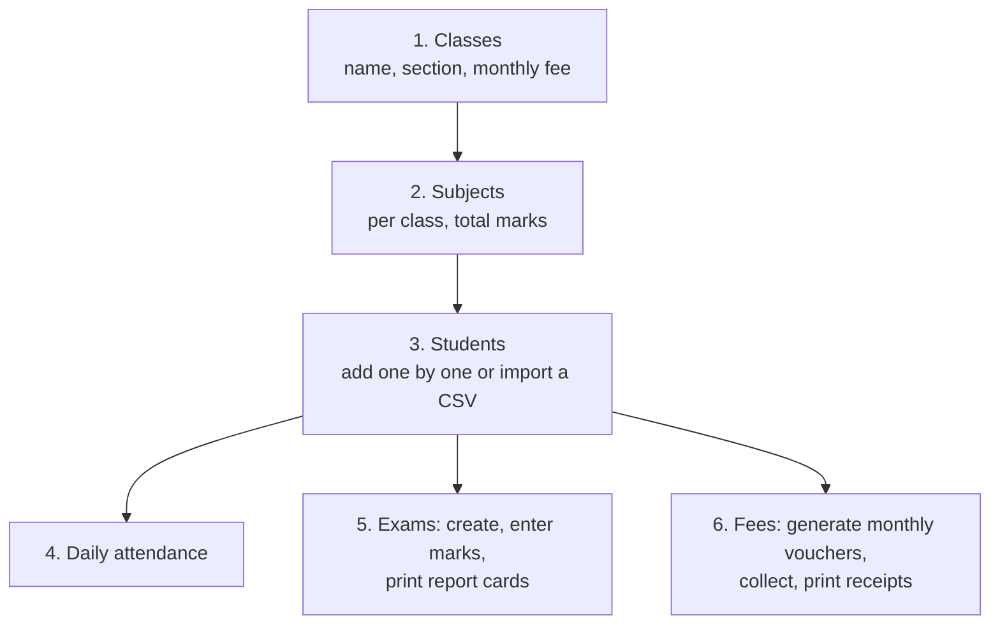

# School Manager

A complete full-stack school management system: **students, teachers, classes, attendance, exams and results, fee vouchers and receipts**, with role-based logins, printable report cards and one-click backup.

- **Frontend:** plain HTML, CSS and JavaScript (no build step)
- **Backend:** Node.js + Express REST API
- **Database:** SQLite (a single file, `data/school.db`)
- **Login:** JWT tokens, bcrypt-hashed passwords, three roles

## Quick start

| Way | Steps |
|---|---|
| **Windows** | Install Node.js LTS from nodejs.org, then double-click `start.bat` |
| **Any OS** | `npm install` then `npm start` |
| **Docker** | `docker compose up -d --build` |

Then open **http://localhost:3000**, keep the **Administrator** tab selected and sign in with **admin / admin123**.
Change that password straight away in *Settings*.

Want sample data to look around first? Run `npm run seed:demo` (only works on an empty database).

## How the pieces fit



```
school-manager/
  server.js          starts Express, serves /public and /api
  db.js              creates tables on first run, default admin
  auth.js            JWT sign/verify, role check
  routes.js          every API endpoint
  seed-demo.js       optional sample data
  public/            the web app (index.html, css/, js/)
  Dockerfile, docker-compose.yml, start.bat, start.sh
  data/              created automatically - your database (back this up)
```

## First-time setup order



Add teachers first if you want to name a class teacher. Create the logins for your staff in the *Control panel* (see below).

## Who can do what

Each role gets its own home page and its own work area.

| Role | Home page | Work area |
|---|---|---|
| **Administrator** | Totals and a "Needs attention" list (classes with no fee, no subjects or no class teacher, teacher logins not linked, students without vouchers, attendance not marked) | Everything: students (add, edit, import), teachers, classes and subjects, fee setup, teacher payroll, users, school details, backup |
| **Teacher** | "My classes": today's attendance status and exam marks progress for each class, with buttons to mark attendance and enter marks | Only the class they are class teacher of: attendance, exam marks, results and report cards, their students |
| **Accountant** | Collected today, this month, still to collect, and a task list | Fees only: generate vouchers, collect payments, print receipts, outstanding dues, daily collection report |

## The three parts and the Control panel

The sign-in page has one tab per part: **Administrator**, **Teacher** and **Accountant**. A login only works from its own tab, and gets a clear message if it is used from the wrong one.

The **Administrator controls everything**. Only an administrator can create logins, from **Control panel** in the menu:

| Tab | What you can do |
|---|---|
| **Teachers** | *Add teacher with login* creates the teacher record, the login and the class assignment in one step. *Create logins for N teachers who have none* makes a login for every teacher already in the system (for example after a CSV import) and shows a printable list of usernames and random passwords, once. |
| **Accountants** | Add accountant logins. |
| **Administrators** | Add more administrators. |

On every tab you can edit a login, set a new password, deactivate or reactivate it, or delete it, and you can see when each person last signed in. You cannot delete or deactivate your own login.

A teacher login is linked to a teacher record and only sees the class that teacher is **class teacher** of. A teacher login that is not linked yet still sees every class (and shows a reminder), so nobody gets locked out.

The server enforces these rules on every request, not just in the menus.

## Everyday features

- **Subjects:** add a class's subjects once, then copy them to any other classes in one click (*Classes > Subjects > Copy these subjects to other classes*).
- **Attendance register:** tap P / A / L per student, "Mark everyone present", monthly report (late counts as present, under 75% is flagged).
- **Marks entry:** a grid of students by subject, Enter moves down the column, marks above the maximum are blocked.
- **Results:** total, percentage, grade (A1 80+, A 70+, B 60+, C 50+, D 40+, E 33+, F), position, pass or fail (pass mark is 33% in every subject). Print one report card, all report cards, or a result sheet.
- **Fees:** set every class's monthly fee in one dialog (*Classes > Set fees for all classes*, with a "Fill all" shortcut); the fee screens warn you when a class has no fee. Set the monthly fee on each class and an optional discount on a student, generate a month's vouchers in one click, record part or full payments (cash, bank, JazzCash, Easypaisa, cheque), print a two-copy receipt, see outstanding dues.
- **CSV:** export most lists; import teachers the same way (*Teachers > Import CSV*, headings like Teacher Name, Subject, Qualification, Mobile, Email, Joining Date); import students from an Excel sheet saved as CSV (*Students > Import CSV*): common headings like Student Name, Father Name, Class, Mobile are recognised, the class can be written "Class 5 A", "5-A" or just "5", and missing classes can be created automatically during the import.
- **Backup:** *Settings > Download backup* gives you a copy of the whole database.
- **Payroll:** set each teacher's monthly salary (on the teacher's own record, or in bulk from *Teachers*), generate a month's salary vouchers, record part or full payments, apply a deduction, print a salary slip, and see who is still owed money. Administrator only.

## If something goes wrong

| Message | Fix |
|---|---|
| `Cannot find module 'express'` | The install did not finish. Delete the `node_modules` folder and double-click `start.bat` again (internet needed). |
| Install fails on `better-sqlite3` | Use the current Node.js LTS (22 or 24). Older or very new versions may have no ready-made build. |
| `Port 3000 already in use` | Run `set PORT=3001` then `node server.js`, and open `http://localhost:3001`. |

## Android, iPhone and desktop apps

Besides the browser and the installable web-app shortcut above, School Manager can also become:

| | Where | What it needs |
|---|---|---|
| **Windows / Mac / Linux app** | `desktop/` — see `desktop/README.md` | Node.js on the computer running it (same as the browser version) |
| **Android app** | `mobile/` — see `mobile/README.md` | Android Studio, free, any OS |
| **iPhone / iPad app** | `mobile/` — see `mobile/README.md` | A Mac with Xcode — this is an Apple requirement, there's no way around it |

The desktop app bundles the same server and opens it in its own window instead of a browser tab.
The Android and iPhone apps are a native shell that opens your server's address full-screen, with
your own icon and splash screen and no address bar — so they need your server to be reachable
from the phone, same as opening it in a phone's browser would.

## Using it on other computers or phones

Run it on one PC in the school office. On any device on the same Wi-Fi or LAN open `http://<that-PC's-IP>:3000` (find the IP with `ipconfig` on Windows). If it does not open, allow Node.js through Windows Firewall.

## Before real use

1. Change the admin password (*Settings*).
2. Put your school name, address and phone in *Settings* (they appear on printouts).
3. Back up regularly: copy the `data` folder, or use *Download backup*. To restore, stop the server and replace `data/school.db` with the backup file.
4. If the system is reachable from the internet, put it behind HTTPS (for example Caddy or Nginx as a reverse proxy) and set a long `JWT_SECRET`.

Settings you can change with environment variables: `PORT` (default 3000), `DATA_DIR` (default `./data`), `ADMIN_PASSWORD` (first admin only), `JWT_SECRET`, `TZ` (Docker image uses `Asia/Karachi`).

## API overview

All endpoints are under `/api` and need `Authorization: Bearer <token>` except login.

| Area | Endpoints |
|---|---|
| Auth | `POST /auth/login`, `GET /auth/me`, `POST /auth/password` |
| Students | `GET/POST /students`, `GET/PUT/DELETE /students/:id`, `POST /students/import` |
| Teachers | `GET/POST /teachers`, `POST /teachers/import`, `PUT/DELETE /teachers/:id` |
| Classes | `GET/POST /classes`, `PUT/DELETE /classes/:id`, `GET/POST /classes/:id/subjects`, `POST /classes/:id/subjects/copy`, `PUT/DELETE /subjects/:id` |
| Attendance | `GET/POST /attendance`, `GET /attendance/report` |
| Exams | `GET/POST /exams`, `DELETE /exams/:id`, `GET /exams/:id/sheet`, `POST /exams/:id/marks`, `GET /exams/:id/results` |
| Fees | `GET /fees`, `GET /fees/dues`, `GET /fees/collection`, `POST /fees/generate`, `GET/PUT /fees/:id`, `POST /fees/:id/pay`, `DELETE /fees/payments/:id` |
| Payroll | `GET /payroll`, `GET /payroll/dues`, `POST /payroll/generate`, `GET/PUT /payroll/:id`, `POST /payroll/:id/pay`, `DELETE /payroll/payments/:id` |
| Admin | `GET/PUT /settings`, `GET/POST /users`, `POST /users/teacher`, `POST /users/teacher-logins`, `PUT/DELETE /users/:id`, `GET /backup` |

## Extending it

Each screen is one function in `public/js/views-*.js`; each API area is one section of `routes.js`. To add a field to students, add the column in `db.js` (with an `ALTER TABLE` for existing databases), then the SQL in `routes.js` and the form in `views-people.js`.

---

## اردو میں فوری آغاز

1. نوڈ جے ایس (Node.js، LTS ورژن) nodejs.org سے انسٹال کریں۔
2. پروجیکٹ فولڈر میں `start.bat` پر ڈبل کلک کریں (یا `npm install` اور پھر `npm start` چلائیں)۔
3. براؤزر میں `http://localhost:3000` کھولیں۔
4. یوزر نیم `admin` اور پاس ورڈ `admin123` سے لاگ اِن کریں، اور فوراً Settings میں جا کر پاس ورڈ بدل دیں۔
5. ترتیب: کلاسز، پھر مضامین (Subjects)، پھر طلبہ، پھر روزانہ حاضری، امتحان اور فیس واؤچر۔
6. دوسرے کمپیوٹر یا موبائل سے چلانے کے لیے اسی نیٹ ورک پر `http://آپ-کے-کمپیوٹر-کا-IP:3000` کھولیں۔
7. بیک اپ کے لیے Settings میں "Download backup" دبائیں، یا `data` فولڈر کی کاپی رکھیں۔
